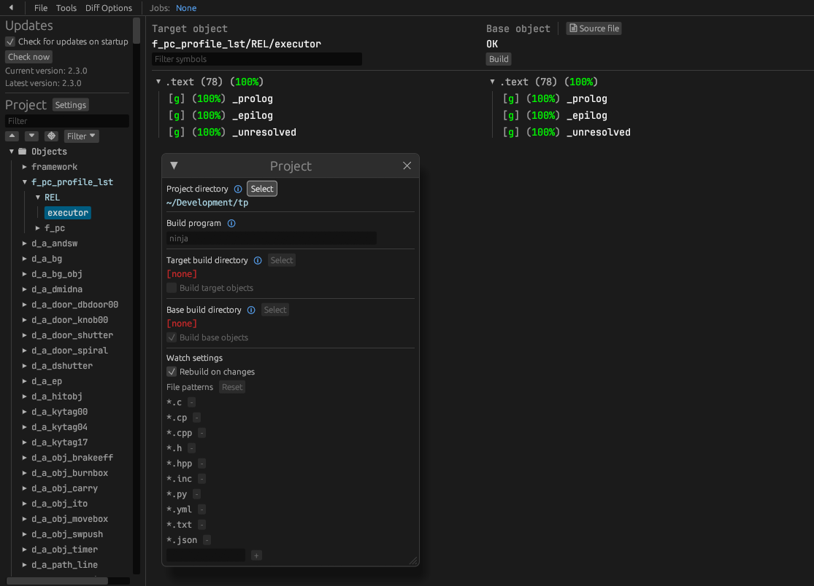

# The Legend of Zelda: Twilight Princess

[![Build Status]][actions] [![Discord Badge]][discord] [![GZ2E01]][progress] [![GZ2P01]][progress] [![GZ2J01]][progress] [![ShieldD]][progress]

[Build Status]: https://github.com/zeldaret/tp/actions/workflows/build.yml/badge.svg
[actions]: https://github.com/zeldaret/tp/actions/workflows/build.yml
[Discord Badge]: https://img.shields.io/discord/688807550715560050?color=%237289DA&logo=discord&logoColor=%23FFFFFF
[discord]: https://discord.com/invite/DqwyCBYKqf

[GZ2E01]: https://decomp.dev/zeldaret/tp/GZ2E01.svg?mode=shield&label=GZ2E01
[GZ2P01]: https://decomp.dev/zeldaret/tp/GZ2P01.svg?mode=shield&label=GZ2P01
[GZ2J01]: https://decomp.dev/zeldaret/tp/GZ2J01.svg?mode=shield&label=GZ2J01
<!-- [RZDE01_00]: https://decomp.dev/zeldaret/tp/RZDE01_00.svg?mode=shield&label=RZDE01_00
[RZDE01_02]: https://decomp.dev/zeldaret/tp/RZDE01_02.svg?mode=shield&label=RZDE01_02
[RZDP01]: https://decomp.dev/zeldaret/tp/RZDP01.svg?mode=shield&label=RZDP01
[RZDJ01]: https://decomp.dev/zeldaret/tp/RZDJ01.svg?mode=shield&label=RZDJ01
[Shield]: https://decomp.dev/zeldaret/tp/Shield.svg?mode=shield&label=Shield -->
[ShieldD]: https://decomp.dev/zeldaret/tp/ShieldD.svg?mode=shield&label=ShieldD
[progress]: https://decomp.dev/zeldaret/tp

A work-in-progress decompilation of The Legend of Zelda: Twilight Princess.

The code for the GameCube releases is completely matching. However, not every Translation Unit (TU) has been linked yet. Work is continuing by aligning the Debug version and getting the Wii versions to match. All versions are built from the same codebase using conditional compilation.

> [!IMPORTANT]
> This repository does **not** contain any game assets or assembly whatsoever. An existing copy of the game is required.
>
> This project itself **is not**, and will not, produce a port, to PC or any other platform. It is a decompilation of the original game code, which can be compiled back into a binary identical to the original.

<!-- markdownlint-disable MD033 -->
[][Progress]
<!-- markdownlint-enable MD033 -->

The project can target the following supported versions:

- **`GZ2E01`**: GameCube - North America
- **`GZ2P01`**: GameCube - Europe/Australia
- **`GZ2J01`**: GameCube - Japan
- `RZDE01_00`: Wii - North America (Rev 0)
- `RZDE01_02`: Wii - North America (Rev 2)
- `RZDP01`: Wii - Europe/Australia
- `RZDJ01`: Wii - Japan
- `Shield`: Nvidia Shield - China
- `ShieldD`: Nvidia Shield - China (Debug Version)

More information about the project can be found here: <https://zsrtp.link>  

<!--ts-->
- [Progress](https://zsrtp.link/progress)
- [Dependencies](#dependencies)
- [Building](#building)
- [Diffing](#diffing)
- [Contributing](#contributing)
- [FAQ](https://zsrtp.link/about)

## Dependencies

You will need the following dependencies:

- git
- ninja
- python3
- clang-format (optional)

### Windows

On Windows, it's **highly recommended** to use native tooling. WSL or msys2 are **not** required.  
When running under WSL, [objdiff](#diffing) is unable to get filesystem notifications for automatic rebuilds.

- Install [Python](https://www.python.org/downloads/) and add it to `%PATH%`.
  - Also available from the [Windows Store](https://apps.microsoft.com/store/detail/python-311/9NRWMJP3717K).
- Download [ninja](https://github.com/ninja-build/ninja/releases) and add it to `%PATH%`.
  - Quick install via pip: `pip install ninja`

### macOS

- Install [ninja](https://github.com/ninja-build/ninja/wiki/Pre-built-Ninja-packages):

  ```sh
  brew install ninja
  ```

[wibo](https://github.com/decompals/wibo), a minimal 32-bit Windows binary wrapper, will be automatically downloaded and used.

### Linux

- Install [ninja](https://github.com/ninja-build/ninja/wiki/Pre-built-Ninja-packages).

[wibo](https://github.com/decompals/wibo), a minimal 32-bit Windows binary wrapper, will be automatically downloaded and used.

## Building

- Clone the repository:

  ```sh
  git clone https://github.com/zeldaret/tp.git
  ```

- Copy your game's disc image to `orig/GZ2E01`.
  - Supported formats: ISO (GCM), RVZ, WIA, WBFS, CISO, NFS, GCZ, TGC.
  - After the initial build, the disc image can be deleted to save space.

- Configure:

  ```sh
  python configure.py
  ```

  To use a version other than `GZ2E01` (GCN USA), specify it with `--version`.
- Build:

  ```sh
  ninja
  ```

## Diffing

Once the initial build succeeds, an `objdiff.json` should exist in the project root.

Download the latest release from [encounter/objdiff](https://github.com/encounter/objdiff). Under project settings, set `Project directory`. The configuration should be loaded automatically.

Select an object from the left sidebar to begin diffing. Changes to the project will rebuild automatically: changes to source files, headers, `configure.py`, `splits.txt` or `symbols.txt`.



## Contributing

If you've got all the requirements set up and want to learn how to contribute to the decompilation effort, join our [Discord server][discord] and check out our [contribution guide](https://zsrtp.link/contribute).
