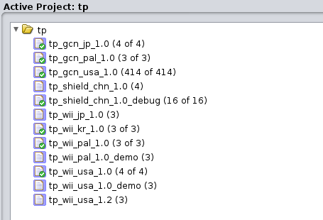

Contributing
=================
Ghidra Setup
-----
1. Install [Java 11 64-bit Runtime and Development Kit](https://www.oracle.com/java/technologies/javase/jdk11-archive-downloads.html).
2. Download Ghidra from [here](https://github.com/NationalSecurityAgency/ghidra/releases).
3. Request an account from Pheenoh#0001 on Discord (either ping him in one of the [Discord](https://discord.gg/Nshw5pHS4h) channels or DM directly).
4. Login using the following server info:  

```
Server: ghidra.tpgz.io
Port: 13100
Username: <your_username>
Password: <your_password>
```

After logging in you will see a list of all the Twilight Princess DOLs for each version.  

 

Getting Started
-----
To begin, select a file to begin work on. You can check what files are available on [Trello](https://trello.com/b/Y04SAxbw/twilight-princess-decompilation).

This project has been automatically generated using `dol2asm`. This process generates blank headers for every source file, default includes, necessary types to be used within the file, forward references, and external references of data / functions used within the file's functions. Additionally, all data and functions have been split and generated with default types.

When decompiling a file, you will need to manually fix structs/classes, function return types, data types, and data definitions. Parameters are already setup for any function with a mangled name. Some functions / data may need to be changed to be auto-generated by the compiler, such as by inlining functions or making data in-function static.

The TP Nvidia Shield Debug Rom contains extra useful info, as it was compiled with less aggressive function inlining, and also contains debug tools / debug strings. While the primary focus currently is on the NTSC-U GameCube version, it is highly recommended to reference the Debug rom for help / documentation.

### diff.py
`diff.py` is the tool we use to fix matching errors. You can invoke `diff.py` from command line like:  
 `python diff.py -mwo mangled_symbol_name`  
- `-m` will run make before opening diff.
- `-w` will automatically update the diff when you save your changes.
- `-o` will diff only the necessary `.o` file, which is recommended for this project.
- `-f` can be used to specify a specific object file to use when diffing with `-o` (Used to diff rels)
- You can find the mangled symbol name in the function info comment. (Ex. `onEventBit__11dSv_event_cFUs`)

NOTE: You must run `./tp expected` with an OK build before diffing to have a correct binary to compare to.

You can install the requirements for `diff.py` by running `pip install -r tools/requirements.txt`.

### tp.py
`tp.py` is a multi-purpose tool that can be used for things such as checking SHA1 checksums, current decompilation progress, and removing unused assembly files.  
You can invoke `tp.py` from command line either directly in the `tools/` folder, or by running the `tp` bash script.
Useful commands:
- `check` - Compares the SHA1 checksums of your current build to the ones of the expected build. Add `--rels` to check rel checksums.
- `expected` - Copies your current build folder to the expected build folder.
- `progress` - Calculates and displays the decompilation progress of the main dol. Add `--rels` to calculate rel progress.
- `remove-unused-asm` - Finds and removes all assembly files that are no longer being used.
- `pull-request` - Verifies that everything is OK before you set up a pull request.

### decomp.me
[decomp.me](https://decomp.me/) is a very useful website for sharing individual functions with other contributers.  
To use decomp.me with TP, select the `GameCube / Wii` platform and `Twilight Princess` compiler preset. Enter your function's mangled name under `Function name`, and copy / paste the function assembly from the project into the `Target assembly` box. Provide any necessary context within the provided box, then create your scratch.  

From here you can use the built-in editor to write your function code. Make sure to save the scratch when you are done, then you can copy and share the URL to receive help matching the function.
